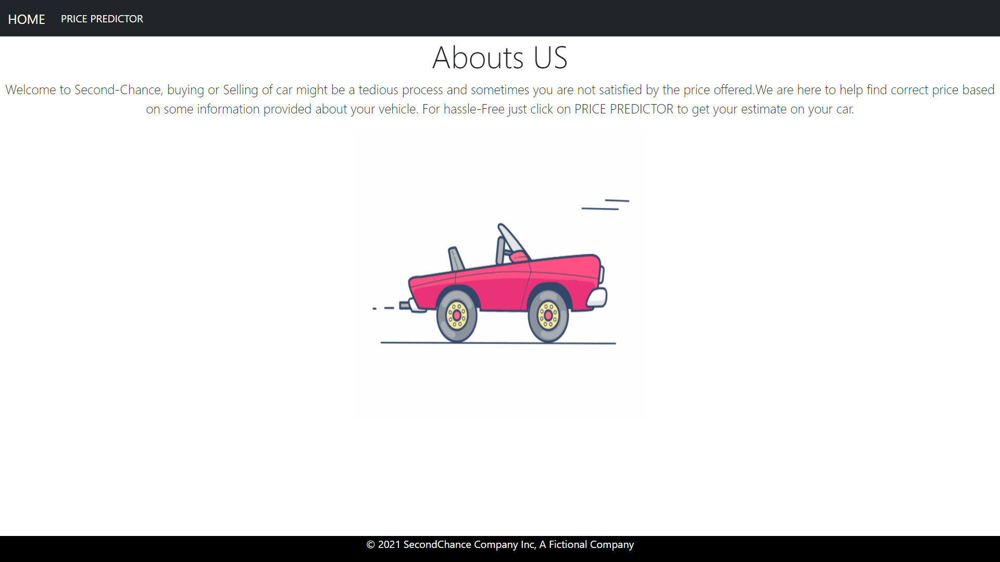

 

# PROBLEM STATEMENT
Buying and Selling of car can be tedious process and sometimes you are not satisfied by the price offered.So Machine Learning model is built that helps in predicting estimated price based on some information provided about the vehicle.

For the Dataset <a href='train-data.csv'>Click Here</a>

</img>

# DATA DEFINITION
BRAND : Brand Name of the vehicle

YEAR : Year of Purchase

LOCATION : Vehicle Loaction

KILOMETERS DRIVEN : Number of KM Driven

FUEL_TYPE : Type of Fuel Used

TRANSMISSION : Manual/Automatic

OWNER_TYPE: Number of Bathrooms

MILEAGE : Mileage of the Car(KM/L)

ENGINE : Engine Displacement(CC)

POWER : Max Power(BHP)

PRICE : Price of the property in Lakhs(Target Variable)

# TECHNOLOGIES USED

       

# APP LINK
Click <a href="https://secondchancecar.herokuapp.com/">here</a>  or type https://secondchancecar.herokuapp.com/ for visiting the site.

## A GLIMPSE OF THE WEB APP:
</img>
